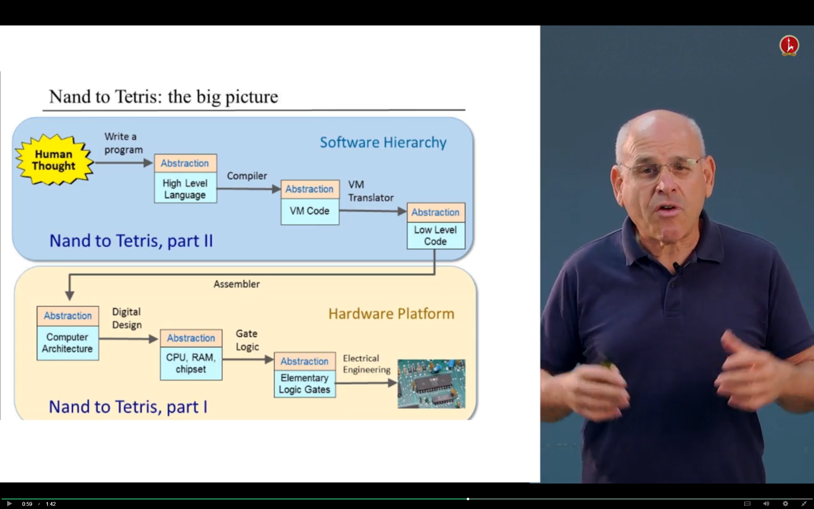

# Nand2Tetris
Building a modern computer from basic Nand gates. Implementing all projects from [nand2tetris.org](http://www.nand2tetris.org/) as well as the book "The Elements of Computing Systems" by Nisan and Schocken.

## Big picture
* Part I: From Nand to Hack, `projects/00-06`
* Part II: From Hack to Tetris,  `projects/07-13`

