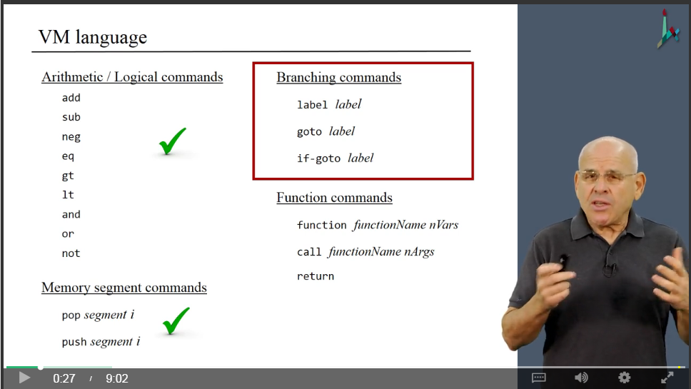

## Project 07

Translate `*.vm` file into `*.asm` file. See `covered_topics.png` for detail.

### Getting started

```bash
$ cd VMTranslator/
$ python main.py [filename.vm]  # translate *.vm into filename.asm
```

### Two Simulators

* Open `VMEmulator` to see the visualization of `*.vm` file. Correspondingly, load test script `*VME.tst`
* Open `CPUEmulator` to compare the generated `*.asm` file. Load test script `*.tst`. Note that the test script will run more steps than the `*.asm` code, so just be patient!


### Covered topics



### Reminder for myself
1. I made a note in OneNote.
2. To generate code for comparision operations, such as `eq` and `jt`, we have to use two branches in which branch1 is to assign value -1 if the result is true, the branch2 is to assign 0 if it's false.  See more details in `VMTranslator/code_writer.py` -- `self._compare()` method.
