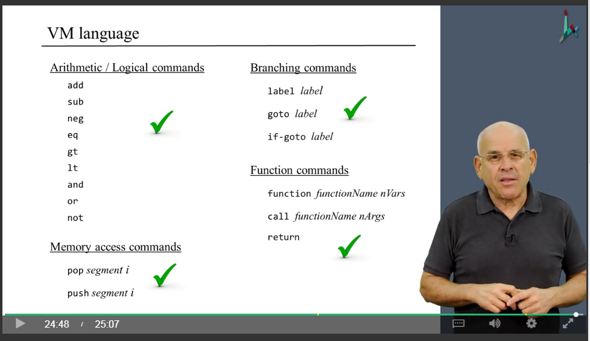
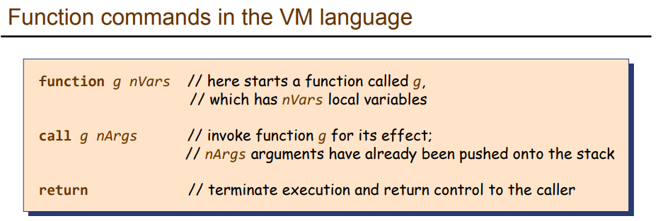
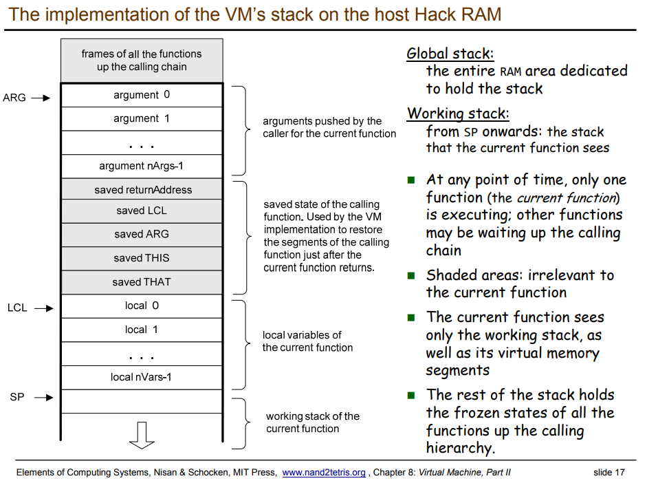

## Project 08

Translate `*.vm` file into `*.asm` file.

### Getting started

```bash
$ cd VMTranslator/
$ python main.py [filename.vm|directoryName]
# if the input is a single source file, output filename.asm
# if the input is directoryName with one or more *.vm files, output directoryName.asm
```

### Two Simulators

* Open `VMEmulator` to see the visualization of `*.vm` file. Correspondingly, load test script `*VME.tst`
* Open `CPUEmulator` to compare the generated `*.asm` file. Load test script `*.tst`. Note that the test script will run more steps than the `*.asm` code, so just be patient!


### Covered topics



### Notes (including screenshots from Coursera and slides from nand2tetris.org)
* [Lecture slides: 08 virtual machine PDF](http://nand2tetris.org/lectures/PDF/lecture%2008%20virtual%20machine%20II.pdf), including the implementation details of `call func nArgs`, `return`, and `function name nLocals`
* 
* 
* Q: Why do we need to save `returnAddress` when call function?
A: It saves the position of code to be executed right after the execution of callee function. It usually uses a unique Label to indicate the start of the rest of the caller function. After the return of callee, it will goto this Label. **In other words, each function will only have one copy of code, rather than many copies whenever it is called.** Therefore, when a callee function returns (i.e., `return` command), we have to know which code to execute next. A simple way is to fetch `returnAddress` from the stack.
* Implementation/Test order (Based on Coursera Unit 2.9 of Part II): 
  * `ProgramFlow/BasicLoop`
  * `ProgramFlow/FibonacciSeries`
  * `FunctionCalls/SimpleFunction`
  * `FunctionCalls/NestedCall` -- has two html files describing more details
  * `FunctionCalls/FibonacciElement`
  * `FunctionCalls/StaticsTest` -- each class needs to maintain its own `static` segment.
